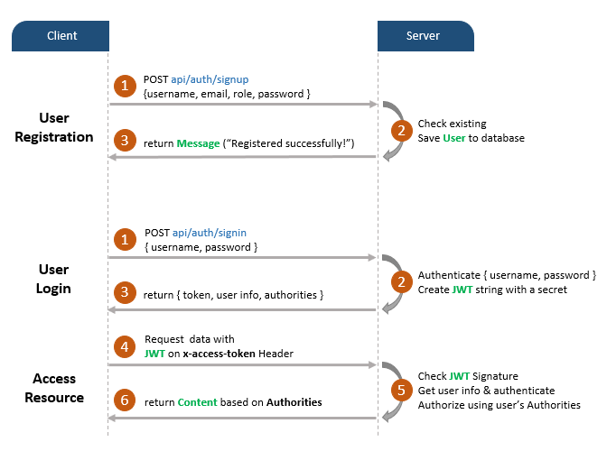
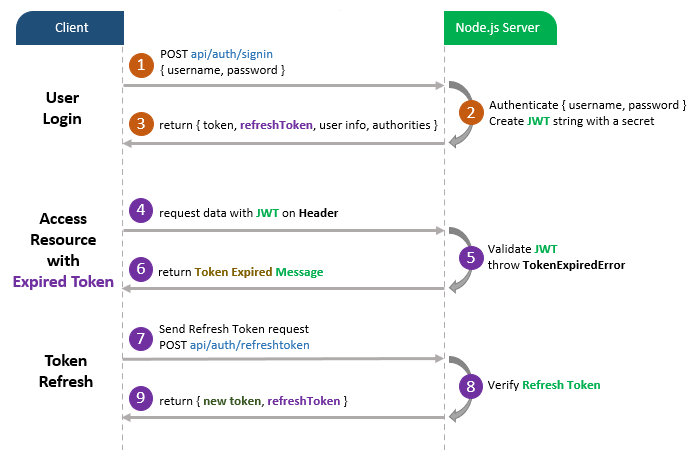
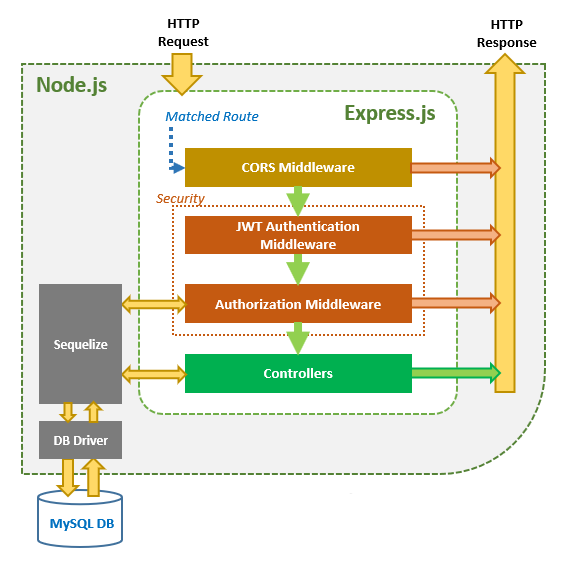

# Gestion des utilisateurs avec NodeJS, Express, Sequelize et MySQL

## Projet
Développer une application de gestion des utilisateurs avec un systeme d'authentification avec Json Web Token (JWT). Vous apprendrez:
- Le processus d'inscription et d'authentification avec JWT
- Architecture de NodeJS Express avec les middlewares CORS, Authentication et Authorization
- Comment configurer les routes Express avec JWT
- Comment définir les modeles de données et les associations pour l'authentification et l'autorisation
- La façon de fonctionner Sequelize avec une base de données relationnelle comme MySQL

## L'authentification basée sur les tokens
En comparaison avec l’authentification basée sur la session qui doit stocker la session sur le cookie, le grand avantage de l’authentification basée sur les jetons est que nous stockons le jeton Web JSON (JWT) côté client: stockage local pour le navigateur, keychain pour IOS et SharedPreferences pour Android ... Nous n’avons donc pas besoin de créer un autre projet principal qui prend en charge les applications natives ou un module d’authentification supplémentaire pour les utilisateurs d’applications natives.


Il existe trois parties importantes d’un JWT : En-tête, Charge utile, Signature. 
Ensemble, ils sont combinés à une structure standard :
```
header.payload.signature
```
Le client attache typiquement JWT dans l’en-tête d’autorisation avec le préfixe de bearer :
```
Authorization: Bearer [header].[payload].[signature]
```
Ou uniquement dans l’en-tête x-access-token :
```
x-access-token: [header].[payload].[signature]
```

## Survole de NodeJS Express avec l'authentification JWT
Nous allons créer une application NodeJS Express dans laquelle:
- Les utilisateurs crée de nouveau compte, ou se logge avec username et password
- Les utilisateurs accèdent à leur espace en fonction des rôles (USER, APPRENANT, PROFESSEUR et ADMIN)

## les APIs fournies par l'application
| Methodes      | Urls                         | Action                                              |
| :---          | :----                        |          :---                                       |
| POST          | /api/auth/signup             | Créer un nouvel compte                              |
| POST          | /api/auth/signin             | Se connecter avec username et password              |
| GET           | /api/test/all                | Le contenu du grand public                          |
| GET           | /api/test/user               | Le contenu des utilisateurs avec le role USER       |
| GET           | /api/test/apprenant          | Le contenu des utilisateurs avec le role APPRENANT  |
| GET           | /api/test/admin              | Le contenu des utilisateurs avec le role ADMIN      |

## Processus d'inscription et de login avec JWT



Un jeton JWT légal doit être ajouté à l'entete HTTP x-access-token si le client accède à des ressources protégées.

Vous devrez implémenter le jeton d’actualisation :



## Architecture NodeJS Express avec Authentification et Autorisation
Vous pouvez avoir un aperçu de notre application Node.js Express avec le diagramme ci-dessous:



Via les routes Express, la requête HTTP qui correspond à une route sera vérifiée par l’intergiciel (middleware) CORS avant d’arriver à la couche de sécurité.

La couche de sécurité comprend :

* Middleware d’authentification JWT : vérifier l’inscription, vérifier le jeton
* Intergiciel (middleware) d’autorisation : vérifier les rôles de l’utilisateur avec l’enregistrement dans la base de données
Si ces intergiciels lèvent une erreur, un message sera envoyé en tant que réponse HTTP.

Les contrôleurs interagissent avec MySQL Database via Sequelize et envoient une réponse HTTP (jeton, informations utilisateur, données basées sur les rôles...) au client.

## Technologies
* Express 4.17.1
* Bcryptjs 2.4.3
* Jsonwebtoken 8.5.1
* Sequelize 5.21.3
* MySQL

## Structure du projet
- config
    + db.config.json: configuration de la base de données MySQL et Sequelize
    + auth.config.js: congiguration clé auth
- routes
    + auth.routes.js: POST signup & signin
    + user.routes.js: GET public & protected resources
- middlewares
    + verifySignUp.js: vérifier doublons sur Username ou Email
    + authJwt.js: vérifier Token, vérifier les roles des utilisateurs dans la base de données
- controllers
    + auth.controller.js: gérer les action d'inscription et de login
    + user.controller.js: returne les contenus publics et protégés
- models
    + user.model.js
    + role.model.js
- server.js: importation et initialisation des modules necessaires et les routes, ecoute pour les connexions.

## Leçon 1: Préparation du projet
### Création, installation des librairies et démarrage du serveur
1. Création du projet
```
$ mkdir backend
$ cd backend
$ npm init -y
$ npm install express@4.17.1 sequelize@6.6.2 mysql2@2.2.5 body-parser@1.19.0 cors@2.8.5 jsonwebtoken@8.5.1 bcryptjs@2.4.3 --save
```
2. Configurer le serveur web Express
```
$ mkdir app
$ vi server.js
```
Code source de server.js
```java
const express = require("express");
const cors = require("cors");

const app = express();

var corsOptions = {
  origin: "http://localhost:4200"
};

app.use(cors(corsOptions));

// Parser les requetes HTTP du content-type - application/json
app.use(express.json());

// Parser les requetes HTTP du content-type - application/x-www-form-urlencoded
app.use(express.urlencoded({ extended: true }));

// simple route
app.get("/", (req, res) => {
  res.json({ message: "Bienvenue sur NodeJS" });
});

// Mettre le port d'écoute 
const PORT = process.env.PORT || 3000;
app.listen(PORT, () => {
  console.log(`Serveur demarre sur le port: ${PORT}.`);
});
```
Quelques explications sur ce que nous avons fait:
- import de express et cors
    * Express pour créer l'API REST
    * cors fourni un middleware express pour activer Cross-origin resource sharing (CORS)
- Création une application express (app) puis le middlewate CORS en utilisant la méthode app.use(). L'origine de la requête est http://localhost:4200.
- Définir une route GET pour tester
- Ecouter les requêtes sur le port 3000
- Demerrer le serveur: 
```
$ node server.js
```
- Tester http://localhost:3000

### Configuration de la base de données et l'ORM Sequelize
1. Créer le fichier config/db.config.js
```java
module.exports = {
    HOST: "localhost",
    USER: "root",
    PASSWORD: "",
    DB: "auth_back",
    dialect: "mysql",
    pool: {
      max: 5,
      min: 0,
      acquire: 30000,
      idle: 10000
    }
  };
  ```
  Les 5 premiers parametres, c'est pour la pour la connexion au serveur de bd MySQL.
  Le parametre pool est optionnel, c'est utilisé pour la configuration d'une pool de connexion Sequelize:
* max: le nombre maximal de connexion dans le pool
* min: le nombre minimal de connexion dans le pool
* acquire: durée maximale, en millisecondes, pendant laquelle la pool tente d'obtenir une connexion, au dela elle genere une erreur.
* idle: durée maximale, en millisecondes, pendant laquelle une connexion peut être inactive avant d’être libérée

### Definition de la couche modele avec Sequelize
1. Dans le dossier models, créer le fichier user.model.js
```java
module.exports = (sequelize, Sequelize) => {
    const User = sequelize.define("users", {
      username: {
        type: Sequelize.STRING
      },
      email: {
        type: Sequelize.STRING
      },
      password: {
        type: Sequelize.STRING
      }
    });
  
    return User;
};
```

2. Dans le dossier models, créer le fichier role.model.js
```java
module.exports = (sequelize, Sequelize) => {
    const Role = sequelize.define("roles", {
      id: {
        type: Sequelize.INTEGER,
        primaryKey: true
      },
      name: {
        type: Sequelize.STRING
      }
    });
  
    return Role;
};
```
Ce modele Sequelize represente 2 tables (users et roles) dans la base de données MySQL.
Apres initialisation de Sequelize, vous n'avez pas besoin d'implementer les fonctiions CRUD, Sequelize les supportes toutes:
* Créer un nouvel utilisateur
```java
create(object)
```
* Trouver un utilisateur via son id
```java
findByPk(id)
```
* Trouver un utilisateur via son email
```java
findOne({ where: { email: ... } })
```
* Retourner tous les utilisateurs
```java
findAll()
```
* Retourner tous les utilisateurs par username
```java
findAll({ where: { username: ... } })
```

Ces fonctions seront utilisées dans les controlleurs et middlewares.

### Initialisation de Sequelize
1. Dans models, créer le fichier index.js
```java
const config = require("../config/db.config.js");

const Sequelize = require("sequelize");
const sequelize = new Sequelize(
  config.DB,
  config.USER,
  config.PASSWORD,
  {
    host: config.HOST,
    dialect: config.dialect,
    operatorsAliases: false,

    pool: {
      max: config.pool.max,
      min: config.pool.min,
      acquire: config.pool.acquire,
      idle: config.pool.idle
    }
  }
);

const db = {};

db.Sequelize = Sequelize;
db.sequelize = sequelize;

db.user = require("../models/user.model.js")(sequelize, Sequelize);
db.role = require("../models/role.model.js")(sequelize, Sequelize);

db.role.belongsToMany(db.user, {
  through: "user_roles",
  foreignKey: "roleId",
  otherKey: "userId"
});
db.user.belongsToMany(db.role, {
  through: "user_roles",
  foreignKey: "userId",
  otherKey: "roleId"
});


db.ROLES = ["USER", "ADMIN", "ETUDIANT", "PROFESSEUR"];

module.exports = db;
```

L'association entre User et Role est plusieur à plusieur (Many To Many).
- Un User peut jouer plusieurs: ```db.user.belongsToMany(db.role, ...)```.
- Un Role peut être jouer par plusieurs User: ```db.role.belongsToMany(db.user, ...)```.

Avec through, foreignKey et otherKey, nous générons une table d'association user_roles.

2. Editer server.js
```java
const express = require("express");
const cors = require("cors");

const app = express();

var corsOptions = {
  origin: "http://localhost:4200"
};

app.use(cors(corsOptions));

// Parser les requetes HTTP du content-type - application/json
app.use(express.json());

// Parser les requetes HTTP du content-type - application/x-www-form-urlencoded
app.use(express.urlencoded({ extended: true }));

// database
const db = require("./app/models");
const Role = db.role;

// En production db.sequelize.sync();
// Supprimer les tables et recharge les données
db.sequelize.sync({force: true}).then(() => {
  console.log('Supprimer et Resync BD avec { force: true }');
  initial();
});

// simple route
app.get("/", (req, res) => {
  res.json({ message: "Bienvenue sur NodeJS" });
});

// Mettre le port d'écoute 
const PORT = process.env.PORT || 3000;
app.listen(PORT, () => {
  console.log(`Serveur demarre sur le port: ${PORT}.`);
});

function initial() {
  Role.create({
    id: 1,
    name: "USER"
  });
 
  Role.create({
    id: 2,
    name: "ETUDIANT"
  });
 
  Role.create({
    id: 3,
    name: "PROFESSEUR"
  });

  Role.create({
    id: 4,
    name: "ADMIN"
  });
}
```
La fonction initial() permet d'avoir 4 enregistrements dans la table roles. En mode dev, tu as parfois besoin de supprimer les tables existantes et resynchroniser la BD. Pour cela, utiliser ```sync({force: true})```

3. Création du schema de BD
```
$ mysql -u root -p
mysql> create database auth_back
```
4. Demarrer le serveur 
```
$ node server.js
```
Resulats:
- Génération des tables users et roles
- Insertion de 4 instances dans la table role

## Leçon 2: Implementation du Middleware
### Configuration de clé d'authentification
Les fonctions jsonwebtoken telles que ```verify()``` ou ```sign()``` utilisent un algorithme qui a besoin d’une clé secrète (un chaine de caracteres) pour encoder et décoder le jeton (token).

Dans le dossier config, créer le fichier auth.config.js
```java
module.exports = {
    secret: "azerty-1234567"
};
```
### Créer les fonctions Middleware
Pour vérifier les inscriptions avant validation, nous aurons besoin de 2 fonctions:
- verifier s'il ya doublon ou pas sur le username ou l'email
- vérifier si le rôle existe ou pas
1. Dans le dossier middleware, créer le fichier verifySignUp.js
```java
const db = require("../models");
const ROLES = db.ROLES;
const User = db.user;

checkDuplicateUsernameOrEmail = (req, res, next) => {
  // Username
  User.findOne({
    where: {
      username: req.body.username
    }
  }).then(user => {
    if (user) {
      res.status(400).send({
        message: "Echec! Username est déja pris!"
      });
      return;
    }

    // Email
    User.findOne({
      where: {
        email: req.body.email
      }
    }).then(user => {
      if (user) {
        res.status(400).send({
          message: "Echec! Email is est deja prise!"
        });
        return;
      }

      next();
    });
  });
};

checkRolesExisted = (req, res, next) => {
  if (req.body.roles) {
    for (let i = 0; i < req.body.roles.length; i++) {
      if (!ROLES.includes(req.body.roles[i])) {
        res.status(400).send({
          message: "Echec! Role n'existe pas = " + req.body.roles[i]
        });
        return;
      }
    }
  }
  
  next();
};

const verifySignUp = {
  checkDuplicateUsernameOrEmail: checkDuplicateUsernameOrEmail,
  checkRolesExisted: checkRolesExisted
};

module.exports = verifySignUp;
```
Pour traiter l'authentification et l'authorisation, nous aurons ces fonctions:
- vérifiez si le jeton est fourni est légal ou non. Nous obtenons le jeton à travers <b>x-access-token</b> des en-têtes HTTP, puis utilisons la fonction verify() de jsonwebtoken.
- vérifiez si les rôles de l’utilisateur contiennent le rôle requis ou non.
2. Dans le dossier middleware, créer le fichier authJwt.js
```java
const jwt = require("jsonwebtoken");
const config = require("../config/auth.config.js");
const db = require("../models");
const User = db.user;

verifyToken = (req, res, next) => {
  let token = req.headers["x-access-token"];

  if (!token) {
    return res.status(403).send({
      message: "No token provided!"
    });
  }

  jwt.verify(token, config.secret, (err, decoded) => {
    if (err) {
      return res.status(401).send({
        message: "Unauthorized!"
      });
    }
    req.userId = decoded.id;
    next();
  });
};

isAdmin = (req, res, next) => {
  User.findByPk(req.userId).then(user => {
    user.getRoles().then(roles => {
      for (let i = 0; i < roles.length; i++) {
        if (roles[i].name === "ADMIN") {
          next();
          return;
        }
      }

      res.status(403).send({
        message: "Role admin requis!"
      });
      return;
    });
  });
};

isProfessor = (req, res, next) => {
  User.findByPk(req.userId).then(user => {
    user.getRoles().then(roles => {
      for (let i = 0; i < roles.length; i++) {
        if (roles[i].name === "PROFESSEUR") {
          next();
          return;
        }
      }

      res.status(403).send({
        message: "Role professeur requis!"
      });
    });
  });
};

isProfessorOrAdmin = (req, res, next) => {
  User.findByPk(req.userId).then(user => {
    user.getRoles().then(roles => {
      for (let i = 0; i < roles.length; i++) {
        if (roles[i].name === "PROFESSEUR") {
          next();
          return;
        }

        if (roles[i].name === "ADMIN") {
          next();
          return;
        }
      }

      res.status(403).send({
        message: "Role admin ou professeur requis!"
      });
    });
  });
};

isStudent = (req, res, next) => {
    User.findByPk(req.userId).then(user => {
      user.getRoles().then(roles => {
        for (let i = 0; i < roles.length; i++) {
          if (roles[i].name === "ETUDIANT") {
            next();
            return;
          }
        }
  
        res.status(403).send({
          message: "Role etudiant requis!"
        });
      });
    });
  };

const authJwt = {
  verifyToken: verifyToken,
  isAdmin: isAdmin,
  isProfessor: isProfessor,
  isProfessorOrAdmin: isProfessorOrAdmin,
  isStudent: isStudent
};
module.exports = authJwt;
```
3. Dans le dossier middleware, créer le fichier index.js

```java
const authJwt = require("./authJwt");
const verifySignUp = require("./verifySignUp");

module.exports = {
  authJwt,
  verifySignUp
};
```

## Leçon 3: Implementation des controlleurs
### Controlleurs pour l'authentification
Nous avons 2 princiaples fonctions à implémenter pour l'authentification:
- ```signup```: crée un nouvel utilisateur dans la BD avec le rôle USER s'il n'est pas spécifié.
- ```signin```:
    * Trouver username de la requête de la base de données s'il existe
    * Comparer le mot de passe saisi avec celui stocké dans base de données un utilisant <b>bcrypt</b> si c'est correct
    * Générer un token en utilisant <b>jsonwebtoken</b>
    * Retouner l'objet user et le token

1. Dans le dossier controllers, créer le fichier auth.controller.js
```java
const db = require("../models");
const config = require("../config/auth.config");
const User = db.user;
const Role = db.role;

const Op = db.Sequelize.Op;

var jwt = require("jsonwebtoken");
var bcrypt = require("bcryptjs");

exports.signup = (req, res) => {
  // Sauvegarder User dans la BD
  User.create({
    username: req.body.username,
    email: req.body.email,
    password: bcrypt.hashSync(req.body.password, 8)
  })
    .then(user => {
        // Si le.s role.s est/sont renseigné.s
      if (req.body.roles) {
        Role.findAll({
          where: {
            name: {
              [Op.or]: req.body.roles
            }
          }
        }).then(roles => {
          user.setRoles(roles).then(() => {
            res.send({ message: "User créé avec succes !" });
          });
        });
      } else {
        // Sinon lui attribuer le role USER (code = 1)
        user.setRoles([1]).then(() => {
          res.send({ message: "User créé avec succes !" });
        });
      }
    })
    .catch(err => {
      res.status(500).send({ message: err.message });
    });
};

exports.signin = (req, res) => {
  User.findOne({
    where: {
      username: req.body.username
    }
  })
    .then(user => {
      if (!user) {
        return res.status(404).send({ message: "User introuvable." });
      }

      var passwordIsValid = bcrypt.compareSync(
        req.body.password,
        user.password
      );

      if (!passwordIsValid) {
        return res.status(401).send({
          accessToken: null,
          message: "Mot de passe invalide!"
        });
      }

      var token = jwt.sign({ id: user.id }, config.secret, {
        expiresIn: 86400 // 24 hours
      });

      var authorities = [];
      user.getRoles().then(roles => {
        for (let i = 0; i < roles.length; i++) {
          authorities.push("ROLE_" + roles[i].name.toUpperCase());
        }
        res.status(200).send({
          id: user.id,
          username: user.username,
          email: user.email,
          roles: authorities,
          accessToken: token
        });
      });
    })
    .catch(err => {
      res.status(500).send({ message: err.message });
    });
};
```
### Controlleurs pour tester l'autorisation
Nous avons 4 fonctions:
- ```/api/test/all``` pour les acces public
- ```/api/test/user``` pour les utilisateurs qui ont le role USER
- ```/api/test/student``` pour les utilisateurs qui ont le role APPRENANT
- ```/api/test/professor``` pour les utilisateurs qui ont le role FORMATEUR
- ```/api/test/admin``` pour les utilisateurs qui ont le role ADMIN

controllers/user.controller.js

```java
exports.allAccess = (req, res) => {
    res.status(200).send("Public Content.");
};
  
exports.userBoard = (req, res) => {
    
    res.status(200).send("Espace des utilisateurs.");
};
  
exports.adminBoard = (req, res) => {
    res.status(200).send("Espace des administrateurs.");
};

exports.professorBoard = (req, res) => {
    res.status(200).send("Espace des professeurs.");
};

exports.studentBoard = (req, res) => {
    res.status(200).send("Espace des etudiants.");
};
```
Maintenant la question c'est, comment on peut combiner les fonctions middleware et controlleur?
### Definition des routes
Nous allons séparer les routes en 2 parties pour l'authentification et l'autorisation.
#### Authentication
* POST ```/api/auth/signup```
* POST ```/api/auth/signin```

- routes/auth.routes.js
```java
const { verifySignUp } = require("../middleware");
const controller = require("../controllers/auth.controller");

module.exports = function(app) {
  app.use(function(req, res, next) {
    res.header(
      "Access-Control-Allow-Headers",
      "x-access-token, Origin, Content-Type, Accept"
    );
    next();
  });

  app.post(
    "/api/auth/signup",
    [
      verifySignUp.checkDuplicateUsernameOrEmail,
      verifySignUp.checkRolesExisted
    ],
    controller.signup
  );

  app.post("/api/auth/signin", controller.signin);
};
```

#### Authorization
* GET ```/api/test/all```
* GET ```/api/test/user```
* GET ```/api/test/student```
* GET ```/api/test/professor```
* GET ```/api/test/admin```

- routes/user.routes.js

```java
const { authJwt } = require("../middleware");
const controller = require("../controllers/user.controller");

module.exports = function (app) {
  
  app.use(function(req, res, next) {
    res.header(
      "Access-Control-Allow-Headers",
      "x-access-token, Origin, Content-Type, Accept"
    );
    next();
  });

  app.get("/api/test/all", controller.allAccess);

  app.get(
    "/api/test/user",
    [authJwt.verifyToken],
    controller.userBoard
  );

  app.get(
    "/api/test/professor",
    [authJwt.verifyToken, authJwt.isProfessor],
    controller.professorBoard
  );

  app.get(
    "/api/test/admin",
    [authJwt.verifyToken, authJwt.isAdmin],
    controller.adminBoard
  );

  app.get(
    "/api/test/student",
    [authJwt.verifyToken, authJwt.isStudent],
    controller.studentBoard
  );
};
```
N'oublier pas d'ajouter les routes dans server.js
```java
...
// routes
require('./app/routes/auth.routes')(app);
require('./app/routes/user.routes')(app);
...
```
### Tester l'appli