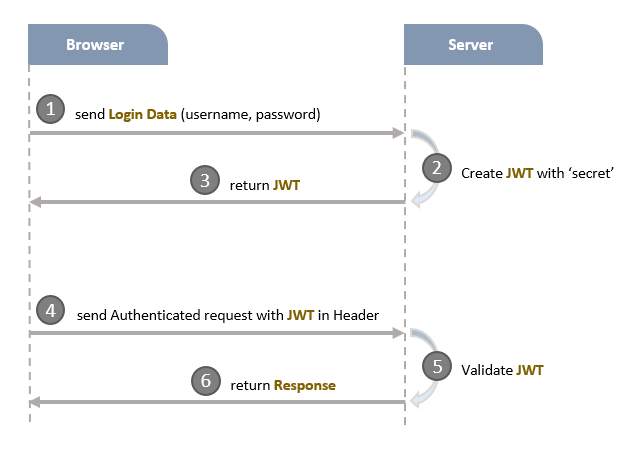

# Gestion des utilisateurs avec NodeJS, Express, Sequelize et MySQL

## Projet
Développer une application de gestion des utilisateurs avec un systeme d'authentification avec Json Web Token (JWT). Vous apprendrez:
- Le processus d'inscription et d'authentification avec JWT
- Architecture de NodeJS Express avec les middlewares CORS, Authentication et Authorization
- Comment configurer les routes Express avec JWT
- Comment définir les modeles de données et les associations pour l'authentification et l'autorisation
- La façon de fonctionner Sequelize avec une base de données relationnelle comme MySQL

## L'authentification basée sur les tokens

